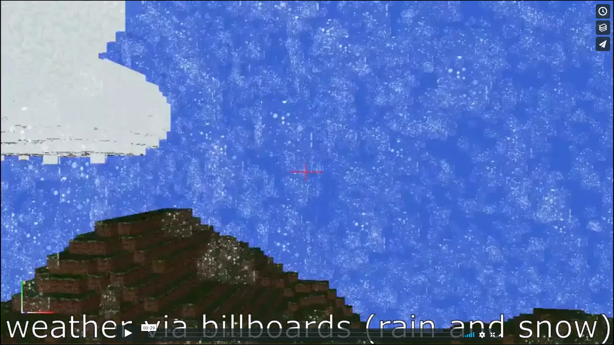

Mini-MineCraft
================

Authors: Aman Sachan, Meghana Seshadri, and Jon Lee

## Features I implemented:
#### Efficient Terrain Rendering:
- Rendering only the hull of the terrain;
- Using interleaved VBOs, i.e one VBO that holds all the data (position, color, normals, textures, etc);
- Dividing the terrain into Chunks and generating the VBO for every chunk only once;

#### Generalized Scheme for Texture Mapping, Normal Mapping, Specular Mapping, and Animated Textures

#### Weather (Snow and Rain) and Cloud:
- Snow and Rain weather effects were achieved via billboards that have a texture with transparency;
- Volumetric Clouds, rendered in a way similar to the ground;

#### Day and Night Cycle:
- Changing Sky Color;
- Changing Light Color;
- Changing Light Direction;
- Changing Light Intensity;
  
#### Tiny Dynamic Compass